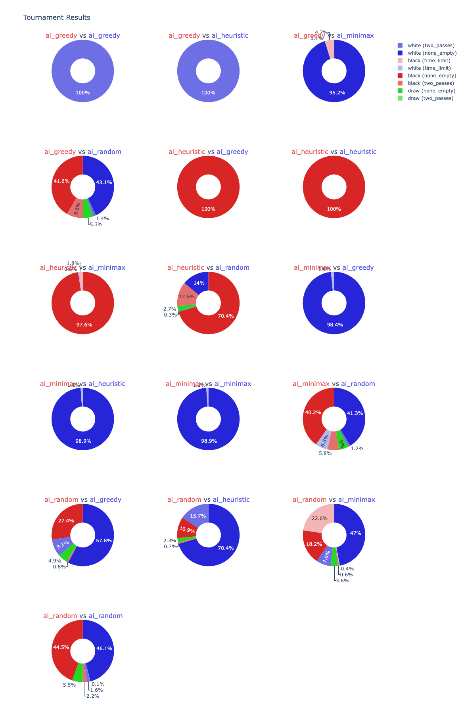

# Goals
1. Do something cool
   - Replicate AlphaEvolve/FunSearch
   - Engineer a scalable distributed infrastructure
   - Make cool visualisations
   - Do it quickly
2. Do something new
   - Evolve a board game AI that performs well
   - Evolve a board game AI that can compete with SOTA
3. Enhance my employability
   - Target: AI Research Engineer/Scientist
   - Skills
     - Experience with LLMs and large textual datasets
     - Data analysis/visualisation
     - Large infrastructure projects

## Evolutionary Tree Visualisation

To explore the evolution of Othello AIs, see the interactive evolutionary tree below (requires JavaScript):

Click to expand the interactive evolutionary tree

<!-- EMBEDDED: evolutionary_tree.html -->
<object type="text/html" data="evolutionary_tree.html" width="100%" height="1200" style="border:1px solid #aaa; min-height:600px;">
  <a href="https://alfredclwong.github.io/assets/html/evolutionary_tree.html">View the evolutionary tree (interactive HTML)</a>
</object>

# Milestones
1. Task setup
   - [x] Othello https://github.com/alfredclwong/othello
     - NxN Othello = 2N^2-bit board, 1-bit player
     - Game has a clock and resolves into (winner, reason)
     - Winner: black/white/draw, reason: none_empty/two_passes/time_limit/illegal_limit
   - Chess?
2. End-to-end basic replication (FunSearch)
   - [x] Cascade evaluation
     - Several levels of difficulty: random/greedy/heuristic/Egaroucid
     - Play 100 games vs each (50/50 black/white), win = +1, lose = -1, draw = 0, min score = 0
     - Achieve threshold score (e.g. 90% winrate) to proceed to next level
     - Evaluations are completed in Docker containers for safety/scaling
   - [x] Fixed prompt
     - Provide skeleton code, task, inspirations, ask for a function completion and accompanying reasoning
     - Skeleton helper functions: `get_legal_squares`, `is_legal_square`, `get_flips`, `is_empty`, `get_size`
     - Skeleton function signature: `def ai(board: T_BOARD, player: Player, clock: T_CLOCK) -> T_SQUARE:`
     - Task: "Complete the ai() function body to return the best move on a 8x8 Othello board. The clock represents the time left for each player to complete all of their remaining moves. Each player starts with 9999 milliseconds. If they run out of time, they lose."
     - Inspirations: previous code completions with scores, sampled as topk
   - [x] Database
     - Store completions, inspirations, and scores
     - Completion: completion code, reasoning text
       - This completion code was generated alongside this reasoning text
     - Inspirations: completion id, inspiration id
       - This completion was inspired by this previous completion (in its prompt)
     - Scores:
       - This completion achieved this score
3. Advanced features (AlphaEvolve)
   - Faster generation/evaluation
     - [2 days] Parallelised Docker containers
     - [?] Parallelised LLM calls
     - Evolution progress visualisation
   - [2 days] *Probabilistic prompting
       - Skeleton variations
       - Imperative: tweak vs explore
       <!-- - Separation of reasoning/coding into two steps -->
       - Inspirations: island-based
       <!-- - Reasoning summaries -->
       <!-- - Long-term planning -->
   - Database
4. [2 days] Visualisation
   - Scaling study (rating vs tok/s)
     - Shows how parallelism can generate performance faster
     - Or how evolutionary algorithm improvements can generate performance faster
   - Evolution tree tracking
     - Show how prompt variation helps to speed up evolution
     - Would be cool to see where final code blocks originated from
   - Ablation studies
5. [3 days] Write-up
   - Interweave visualisation updates as required
6. Improvements
   - Diff model
     - Instead of completing one function, allow free edits across an entire source file
7. Scaling

Use LLMs to code efficient Chess/Othello AIs.

Evaluation is self-play.

TODO

- Scaffolding (requires diff)
  - Opening book
  - Tree search
  - Scoring
  - Clock management
- Diff model
- Prompt improvement
  - Templates (tweak/expand/etc.)
  - Island-based evolution
  - Previous reasoning included in prompts
  - Meta-prompt
- Engineering
  - Parallel Docker eval
  - Parallel LLM queries
- Vis
  - Games/ratings
- Stronger eval AIs
